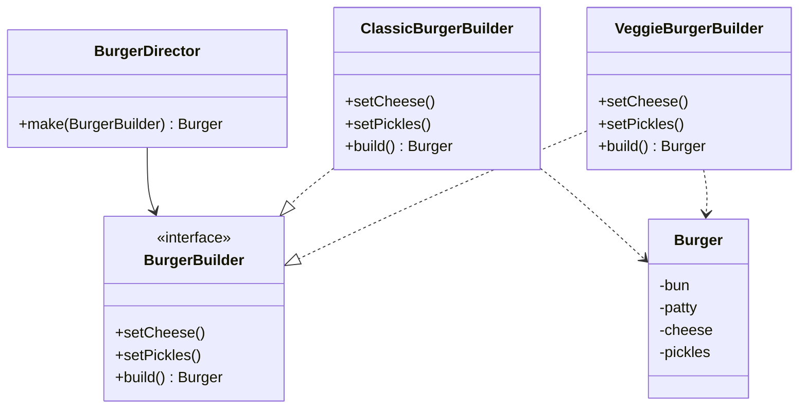

<div class="flex-1 flex items-center justify-center text-center text-2xl">

*Für Erweiterbarkeit: Sobald eine Methode des Builders anders implementiert werden soll<br><br>→ Interface + mehrere Builder*

</div>

---

# Lösung: Interface für mehrere Builder

<div class="grid grid-cols-2 gap-4">
<div>

**Interface definiert den Vertrag**

```dart
abstract interface class BurgerBuilder {
  void setCheese();
  void setPickles();
  Burger build();
}
```

</div>
<div>

**Konkrete Builder implementieren** <span class="inline-block cursor-help" title="Die konkreten Builder haben hier Standardwerte (z.B. Brioche + Rind) fest eingebaut. Es gibt keine Pflichtfelder im Konstruktor - jeder Builder 'weiß' bereits, welchen Burger er baut.">ℹ️</span>

```dart {1,3,6-7,9,11,14-15}
class ClassicBurgerBuilder implements BurgerBuilder {
  @override
  void setCheese() { /* Cheddar */ }

  @override
  Burger build() => Burger('Brioche', 'Rind', ...);
}

class VeggieBurgerBuilder implements BurgerBuilder {
  @override
  void setCheese() { /* Veganer Käse */ }

  @override
  Burger build() => Burger('Vollkorn', 'Gemüse', ...);
}
```

</div>
</div>

---

# Director mit Interface

<div class="grid grid-cols-2 gap-4">
<div>

**Director kennt nur das Interface** <span class="inline-block cursor-help" title="1. Director bekommt irgendeinen Builder übergeben (er weiß nur: Das ist ein Builder). 2. Er ruft die Methoden auf, die das Interface garantiert. 3. Die konkrete Implementierung entscheidet, was passiert. 4. Burger vor dem Methodennamen ist der Rückgabetyp - die Methode gibt ein Objekt vom Typ Burger zurück.">ℹ️</span>

```dart
class BurgerDirector {

  Burger make(BurgerBuilder builder) {
    builder.setCheese();
    builder.setPickles();
    return builder.build();
  }
}
```

</div>
<div>

**Verwendung in main()** <span class="inline-block cursor-help" title="Die leeren Klammern bei ClassicBurgerBuilder() bedeuten: Es wird ein Objekt mit Standardwerten erstellt. Es müssen keine Pflichtfelder übergeben werden, da der Builder seine Werte bereits kennt.">ℹ️</span>

```dart
void main() {
  var director = BurgerDirector();

  // Gleiche Methode, verschiedene Builder
  var classic = director.make(ClassicBurgerBuilder());
  var veggie = director.make(VeggieBurgerBuilder());
}
```

</div>
</div>

<div v-click class="mt-8 text-center">

Der Director ruft `builder.setCheese()` auf – <span class="text-green-400">welcher Käse</span> verwendet wird, entscheidet der <span class="text-yellow-400">konkrete Builder</span>!

</div>

---

# Klassendiagramm mit Interface



**Fazit:** Ab 2+ Buildern lohnt sich ein Interface → Director bleibt unverändert
