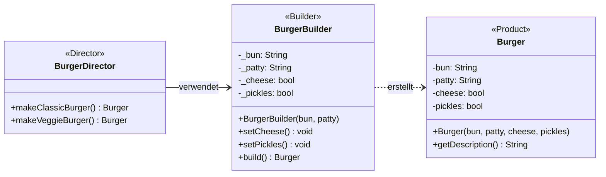

# Klassendiagramm

Builder Pattern einfache Struktur

**Legende:**
- **Director** (BurgerDirector): Kapselt vordefinierte Rezepte
- **Builder** (BurgerBuilder): Ermöglicht schrittweisen Aufbau
- **Product** (Burger): Das fertige Objekt
