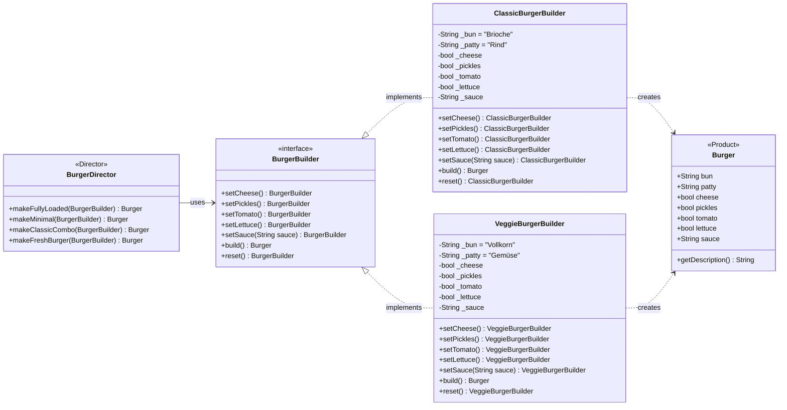

# Live-Demo

<a href="https://github.com/Bachelor-MMB7/builder-pattern-demo" target="_blank" class="mt-4 text-gray-400 hover:text-blue-400">github.com/Bachelor-MMB7/builder-pattern-demo</a>

---

# Demo-UML

